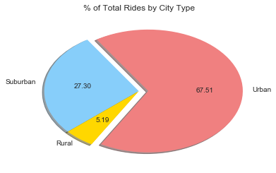
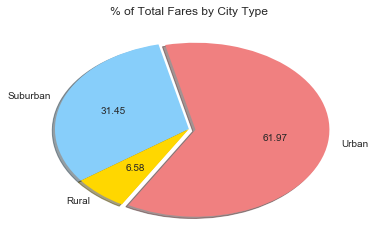
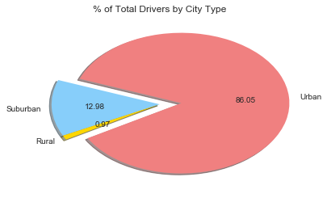
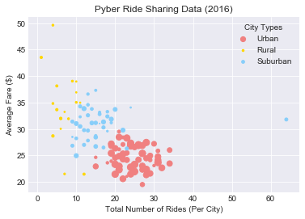

```python
# Dependencies
import matplotlib.pyplot as plt
import numpy as np
import pandas as pd
import seaborn
```


```python
#Read in data files
city_data = pd.read_csv("Pyber/raw_data/city_data.csv")
ride_data = pd.read_csv("Pyber/raw_data/ride_data.csv")
```


```python
city_data.head()
```


<div>
<style>
    .dataframe thead tr:only-child th {
        text-align: right;
    }

    .dataframe thead th {
        text-align: left;
    }

    .dataframe tbody tr th {
        vertical-align: top;
    }
</style>
<table border="1" class="dataframe">
  <thead>
    <tr style="text-align: right;">
      <th></th>
      <th>city</th>
      <th>driver_count</th>
      <th>type</th>
    </tr>
  </thead>
  <tbody>
    <tr>
      <th>0</th>
      <td>Kelseyland</td>
      <td>63</td>
      <td>Urban</td>
    </tr>
    <tr>
      <th>1</th>
      <td>Nguyenbury</td>
      <td>8</td>
      <td>Urban</td>
    </tr>
    <tr>
      <th>2</th>
      <td>East Douglas</td>
      <td>12</td>
      <td>Urban</td>
    </tr>
    <tr>
      <th>3</th>
      <td>West Dawnfurt</td>
      <td>34</td>
      <td>Urban</td>
    </tr>
    <tr>
      <th>4</th>
      <td>Rodriguezburgh</td>
      <td>52</td>
      <td>Urban</td>
    </tr>
  </tbody>
</table>
</div>


```python
ride_data.head()
```


<div>
<style>
    .dataframe thead tr:only-child th {
        text-align: right;
    }

    .dataframe thead th {
        text-align: left;
    }

    .dataframe tbody tr th {
        vertical-align: top;
    }
</style>
<table border="1" class="dataframe">
  <thead>
    <tr style="text-align: right;">
      <th></th>
      <th>city</th>
      <th>date</th>
      <th>fare</th>
      <th>ride_id</th>
    </tr>
  </thead>
  <tbody>
    <tr>
      <th>0</th>
      <td>Sarabury</td>
      <td>2016-01-16 13:49:27</td>
      <td>38.35</td>
      <td>5403689035038</td>
    </tr>
    <tr>
      <th>1</th>
      <td>South Roy</td>
      <td>2016-01-02 18:42:34</td>
      <td>17.49</td>
      <td>4036272335942</td>
    </tr>
    <tr>
      <th>2</th>
      <td>Wiseborough</td>
      <td>2016-01-21 17:35:29</td>
      <td>44.18</td>
      <td>3645042422587</td>
    </tr>
    <tr>
      <th>3</th>
      <td>Spencertown</td>
      <td>2016-07-31 14:53:22</td>
      <td>6.87</td>
      <td>2242596575892</td>
    </tr>
    <tr>
      <th>4</th>
      <td>Nguyenbury</td>
      <td>2016-07-09 04:42:44</td>
      <td>6.28</td>
      <td>1543057793673</td>
    </tr>
  </tbody>
</table>
</div>


```python
#merges imported data to have 1 final data table to work off of
final_data = pd.merge(ride_data,city_data, how = 'left', on = 'city')
final_data.head()
```


<div>
<style>
    .dataframe thead tr:only-child th {
        text-align: right;
    }

    .dataframe thead th {
        text-align: left;
    }

    .dataframe tbody tr th {
        vertical-align: top;
    }
</style>
<table border="1" class="dataframe">
  <thead>
    <tr style="text-align: right;">
      <th></th>
      <th>city</th>
      <th>date</th>
      <th>fare</th>
      <th>ride_id</th>
      <th>driver_count</th>
      <th>type</th>
    </tr>
  </thead>
  <tbody>
    <tr>
      <th>0</th>
      <td>Sarabury</td>
      <td>2016-01-16 13:49:27</td>
      <td>38.35</td>
      <td>5403689035038</td>
      <td>46</td>
      <td>Urban</td>
    </tr>
    <tr>
      <th>1</th>
      <td>South Roy</td>
      <td>2016-01-02 18:42:34</td>
      <td>17.49</td>
      <td>4036272335942</td>
      <td>35</td>
      <td>Urban</td>
    </tr>
    <tr>
      <th>2</th>
      <td>Wiseborough</td>
      <td>2016-01-21 17:35:29</td>
      <td>44.18</td>
      <td>3645042422587</td>
      <td>55</td>
      <td>Urban</td>
    </tr>
    <tr>
      <th>3</th>
      <td>Spencertown</td>
      <td>2016-07-31 14:53:22</td>
      <td>6.87</td>
      <td>2242596575892</td>
      <td>68</td>
      <td>Urban</td>
    </tr>
    <tr>
      <th>4</th>
      <td>Nguyenbury</td>
      <td>2016-07-09 04:42:44</td>
      <td>6.28</td>
      <td>1543057793673</td>
      <td>8</td>
      <td>Urban</td>
    </tr>
  </tbody>
</table>
</div>


```python
#Creates the pie plot for the % of total Rides by City Type
#uses value_counts of "type" from the final_data dataframe


#total = final_data['type'].count()
type_plot = plt.pie(final_data['type'].value_counts(), explode = [0.10,0, 0], labels = final_data['type'].unique(),
                    autopct='%.2f',colors = ['LightCoral', 'LightSkyBlue', 'Gold'],shadow = True, startangle = 240)
plt.title('% of Total Rides by City Type')
plt.savefig('rides_city_type.png')
plt.show()
#total
```





```python
#Creates pie plot of % of total fare by city type
#calculates sum of all the fares, lists of sums for each city type
#the for loop calculates the average for each sum and converts it to a percentage


fare_sum = final_data['fare'].sum()
sum_list = []
temp = final_data.loc[final_data['type'] == 'Urban']
urban_sum = temp['fare'].sum()
sum_list.append(urban_sum)
temp = final_data.loc[final_data['type'] == 'Suburban']
sub_sum = temp['fare'].sum()
sum_list.append(sub_sum)
temp = final_data.loc[final_data['type'] == 'Rural']
rural_sum = temp['fare'].sum()
sum_list.append(rural_sum)
i = 0
for item in sum_list:
    sum_list[i] = (sum_list[i]/fare_sum)*100
    i = i+1
fare_type_plot = plt.pie(sum_list, explode = [0.05, 0 , 0], labels = final_data['type'].unique(),autopct = '%.2f'
                        , colors = ['LightCoral', 'LightSkyBlue', 'Gold'],shadow = True, startangle = 240)
plt.title('% of Total Fares by City Type')
plt.savefig('fares_city_type.png')
plt.show()
```





```python
#creates pie plot of % of total drivers by city type
#same process as above but uses driver_count rather than fare


driver_sum = final_data['driver_count'].sum()
sum_list = []
temp = final_data.loc[final_data['type'] == 'Urban']
urban_sum = temp['driver_count'].sum()
sum_list.append(urban_sum)
temp = final_data.loc[final_data['type'] == 'Suburban']
sub_sum = temp['driver_count'].sum()
sum_list.append(sub_sum)
temp = final_data.loc[final_data['type'] == 'Rural']
rural_sum = temp['driver_count'].sum()
sum_list.append(rural_sum)
i = 0
for item in sum_list:
    sum_list[i] = (sum_list[i]/fare_sum)*100
    i = i+1
fare_type_plot = plt.pie(sum_list, explode = [0.20, 0 , 0], labels = final_data['type'].unique(),autopct = '%.2f'
                         ,colors = ['LightCoral', 'LightSkyBlue', 'Gold'],shadow = True, startangle = 210)
plt.title('% of Total Drivers by City Type')
plt.savefig('drivers_city_type.png')
plt.show()
```





```python
final_data.head()
```


<div>
<style>
    .dataframe thead tr:only-child th {
        text-align: right;
    }

    .dataframe thead th {
        text-align: left;
    }

    .dataframe tbody tr th {
        vertical-align: top;
    }
</style>
<table border="1" class="dataframe">
  <thead>
    <tr style="text-align: right;">
      <th></th>
      <th>city</th>
      <th>date</th>
      <th>fare</th>
      <th>ride_id</th>
      <th>driver_count</th>
      <th>type</th>
    </tr>
  </thead>
  <tbody>
    <tr>
      <th>0</th>
      <td>Sarabury</td>
      <td>2016-01-16 13:49:27</td>
      <td>38.35</td>
      <td>5403689035038</td>
      <td>46</td>
      <td>Urban</td>
    </tr>
    <tr>
      <th>1</th>
      <td>South Roy</td>
      <td>2016-01-02 18:42:34</td>
      <td>17.49</td>
      <td>4036272335942</td>
      <td>35</td>
      <td>Urban</td>
    </tr>
    <tr>
      <th>2</th>
      <td>Wiseborough</td>
      <td>2016-01-21 17:35:29</td>
      <td>44.18</td>
      <td>3645042422587</td>
      <td>55</td>
      <td>Urban</td>
    </tr>
    <tr>
      <th>3</th>
      <td>Spencertown</td>
      <td>2016-07-31 14:53:22</td>
      <td>6.87</td>
      <td>2242596575892</td>
      <td>68</td>
      <td>Urban</td>
    </tr>
    <tr>
      <th>4</th>
      <td>Nguyenbury</td>
      <td>2016-07-09 04:42:44</td>
      <td>6.28</td>
      <td>1543057793673</td>
      <td>8</td>
      <td>Urban</td>
    </tr>
  </tbody>
</table>
</div>


```python
#creates bubble chart for the ride sharing data
#first 3 sections are for getting necessary data and separating them by type
#size is stored as _size, ride count is stored as rides_city_ using value_counts()
#for loops are mkade to get the average fare for each city


urban_data = final_data[final_data['type']=='Urban']
rural_data = final_data[final_data['type']=='Rural']
sub_data = final_data[final_data['type']=='Suburban']

urban_size = (urban_data['driver_count'])
rural_size = (rural_data['driver_count'])
sub_size = (sub_data['driver_count'])

rides_city_urban = urban_data['city'].value_counts()
rides_city_rural = rural_data['city'].value_counts()
rides_city_sub = sub_data['city'].value_counts()


urban_temp = []
urban_temp_avg = 0
for city in urban_data['city'].unique():
    temp_df = urban_data[urban_data['city']==city]
    urban_temp_avg = temp_df['fare'].mean()
    urban_temp.append(urban_temp_avg)

rural_temp = []
rural_temp_avg = 0
for city in rural_data['city'].unique():
    temp_df = rural_data[rural_data['city']==city]
    rural_temp_avg = temp_df['fare'].mean()
    rural_temp.append(rural_temp_avg) 
    
sub_temp = []
sub_temp_avg = 0
for city in sub_data['city'].unique():
    temp_df = sub_data[sub_data['city']==city]
    sub_temp_avg = temp_df['fare'].mean()
    sub_temp.append(sub_temp_avg)

#each city type plot is created separately    
#titles and legend are added after it is created    
    
    
urban_plot = plt.scatter(rides_city_urban,urban_temp, s = urban_size, c = 'lightcoral')
rural_plot = plt.scatter(rides_city_rural,rural_temp, s = rural_size, c = 'gold')
sub_plot = plt.scatter(rides_city_sub, sub_temp, s = sub_size, c = 'lightskyblue')
plt.style.use('seaborn-dark')
plt.title('Pyber Ride Sharing Data (2016)')
plt.xlabel('Total Number of Rides (Per City)')
plt.ylabel('Average Fare ($)')
plt.legend(['Urban','Rural','Suburban'],title = 'City Types')
plt.savefig('ride_sharing_data.png')
plt.show()
#print(len(rides_city_urban),len(urban_temp))
#len(urban_data['city'].unique())


#final_data['type'].value_counts()
#urban_data
#rural_data
#sub_data
```




